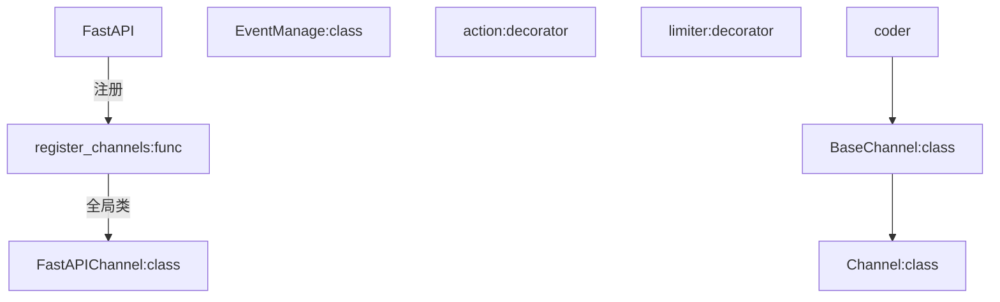

# 2024-10-27 08:41:21

理念:
精简、高效、直观、明了

目标:
完成0.0.1的版本

思路:
action装饰器本身默认的permission就是None不如直接把permission和action绑定
permission如果使用类或者函数可以使用__doc__属性来获取perm_desc的值，可以不用往action中传入desc
limiter还是不要和action绑定在一起了，还是采用单独的装饰器的形式？目前思考（纠结）的是有些limiter可能是
想多设置一个detached来提供单独处理的服务也就是后台任务？目前思考fastapi.BackgroundTasks有没有这种能力能不能好的适配到我的项目中
websocket和channel被反复传参，想结合ctx来减少这种问题
想通过类型注释中指定的Channel类来控制对应的websocket接口的处理响应就是没必要在接口中写对应的响应(或许要通过装饰器来实现)

```python
from fastapi import FastAPI, WebSocket
from fastapi_channels import Channel

app = FastAPI()


@app.websocket('/')
async def ws_endpoint(websocket: WebSocket):
    await Channel().connect(websocket)


# update
app = FastAPI()


@app.websocket('/')
async def ws_endpoint(websocket: WebSocket) -> Channel:
    ...


```

修改:



```python
from typing import Annotated, Any
from typing_extensions import Doc  # noqa


def action(
        name: Annotated[
            str,
            Doc(
                """前端上传action应该传的值，以及action的名字"""
            )],
        *,
        description: Annotated[
            Any,
            Doc(
                """action对应的解释，将来运用到fastapi-channel的文档里面,如果不显示的在这里指定，程序也会拿取函数中的__doc__属性"""
            )
        ] = None,
        permisssion: Annotated[
            Any,
            Doc(
                """action对应的权限，和permission_classes将会一起被检验，通过才能进行action内的信息.在fastapi-channel的文档里面，
                将会提取permission对应的__doc__的值作为permission_description"""
            )
        ] = None,
        # detached: Annotated[
        #     bool,
        #     Doc(
        #         """action是否独立允许,如一些分批响应可以使用这个"""
        #     )
        # ] = False,

):
    ...

```

施工计划:
在0.0.2的版本中将加入detached
在0.0.3的版本中将加入内置的paginate帮助更好的分页

# 测试例子
简单的测试