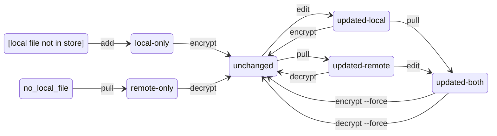

# Git Secret Store

This is a simple commandline utility to manage repositories of encrypted files.
You can install it from PyPI as:

```
pip install git-secret-store
```

This makes the `git-secret` command available on the system, which can be invoked inside individual Git repositories to manage secret stores.
Run `git-secret -h` or read the documentation below for help on available sub-commands.

Note: the project is not related to the [`gitsecret`](https://pypi.org/project/gitsecret/) package or the (now defunct) [git-secret.io](https://web.archive.org/web/20200601000000*/git-secret.io) commandline utility, although the basic goals are similar.

## Basic Principles

The `git-secret` command uses `.gitignore` to ensure that files and folders not explicitly added to the **secret store** are ignored by default, reducing the likelyhood of unintended commit of confidential data.

Files can be added to the secret store in two ways:

- as **unmanaged files**, which are committed in plaintext
- as **managed files**, which are committed in hash and ciphertext

For its functionality, the secret store relies on management of the `.gitignore` file, which should not be edited manually.
The secret store reserves the following file extensions:

- `.secret` is reserved for the committed ciphertexts of managed files
- `.remote-hash` is reserved for the committed SHA3-256 hashes of managed files
- `.local-hash` is reserved for the local SHA3-256 hashes of managed files, used to detect changes
- `.error` is reserved for error files, used to persist knowledge of errors with managed files

The secret store reserves the following file names:

- `.mnemonic` is reserved for the [BIP 39 Mnemonic](https://github.com/bitcoin/bips/blob/master/bip-0039.mediawiki) used to generate the secret AES-256 key
- `.keyhash` is reserved for the SHA3-256 hash of the AES-256 key
- `.gitignore` and `.git`, for basic git functionaltiy.

All other files are available for addition to the repository, using the [`add`](#adding-managed-files-to-the-store) command for managed files and the [`add-unmanaged`](#adding-unmanaged-files-to-the-store) command for unmanaged files.
See [Getting Started](#getting-started) and [Store Operation](#store-operation) for operating instructions.


## Getting Started

### Admin

The administrator should follow the steps below to initialise the secret store:

1. In an empty Git repository, run `git-secret init!` to create a `.gitignore` file with the correct structure.
2. Run `git-secret keygen!` to generate a secret key.
3. Commit the contents of the initialised secret store: `.gitignore` and `.keyhash`.


At this point, the aministrator can start using the repository.
The administrator should privately communicate the 24-word mnemonic contained in the `.mnemonic` file to each intended user of the store.

### Users

The users should follow the steps below to initialise the secret store:

1. Pull the secret store created by the administrator.
2. Create a `.mnemonic` file locally and write the 24-word mnemonic communicated by the administrator, one word per line.
3. Run `git-secret keycheck` to ensure that the `.mnemonic` file has been filled correctly.

At this point, the user can start using the repository.


## Store Operation

Files not known to the store are not committed, while unmanaged files known to the store are committed in plaintext.
As a consequence, in this section we will focus on managed files only.

Ordinary operation of the secret store goes via the following actions:

- [`add`](#adding-managed-files-to-the-store)ition of managed files to the secret store
- local editing of managed files
- pulling of remote changes
- committing of local changes (+ pushing)
- [`encrypt`](#encrypting-files)ion of managed files
- [`decrypt`](#decrypting-files)ion of managed files
- [`check`](#checking-files)ing of managed file status

Ordinarily, there are four files related to each managed file known to the store:

- The **plaintext file**, e.g. `my-secret.txt`.
- A **local hash file** , e.g. `my-secret.txt.local-hash`, containing the SHA3-256 hash of the plaintext file.
- A **ciphertext file**, e.g. `my-secret.txt.secret`, containing the AES-256 encryption of the plaintext file.
- A **remote hash file**, e.g. `my-secret.txt.remote-hash`, containing the SHA3-256 hash of the plaintext decrypted from the ciphertext file.

When a file is first added to the store, only the plaintext file is present.
At the time when the file is first encrypted, the local hash file, ciphertext file and remote hash files are created.

The ciphertext file and remote hash file are added as exceptions to `.gitignore`, so they can be committed (they must always be committed together).
The plaintext and local hash files are both ignored by commits: the plaintext file to avoid accidentally exposing a secret, the local hash file to efficiently keep track of local vs remote changes.

Ordinarily, there are six possible statuses for a manged file:

- `local-only` indicates that there is a plaintext file, but no ciphertext file nor remote hash file. The local hash file is not checked.
- `remote-only` indicates that there are ciphertext and remote hash files, but no plaintext file.
- `unchanged` indicates that there are plaintext, ciphertext and remote hash files, and that the hash of the plaintext file coincides with the contents of the remote hash file.
- `updated-remote` indicates that there are plaintext, ciphertext, local hash and remote hash files, that the hash of the plaintext file coincides with the contents of the local hash file, and that they both differ from the contents of the remote hash file.
- `updated-local` indicates that there are plaintext, ciphertext, local hash and remote hash files, that the local and remote hash files coincide, and that they both differ from the hash of the plaintext file.
- `updated-both` indicates that there are plaintext, ciphertext and remote hash files, that the hash of the plaintext file differs from the remote hash file, and that either the local hash file is missing or that it differs from both the hash of the plaintext file and the remote hash file.

The following diagram summarises the lifecycle of a managed file in the secret store:



The following actions might change files, but don't change the file status:

- editing a `local-only`, `updated-local` or `updated-both` file
- pulling a `remote-only`, `updated-local` or `updated-both` file

The following actions don't result in any change:

- encrypting an `unchanged` or `remote-only` file
- encrypting an `updated-remote` or `updated-both` file, unless `git-secret encrypt --force` is used
- decrypting an `unchanged` or `local-only` file
- decrypting an `updated-local` or `updated-both` file, unless `git-secret decrypt --force` is used

Two additional managed file statuses indicate an error situation:

- `missing` indicates that the plaintext, ciphertext and remote hash files are all missing.
- `error` indicates that an integrity check failed.

The presence of an additional **error file**, e.g. `my-secret.txt.error`, indicates that an error for this file was detected while [Checking Files](#checking-files) or [Decrypting Files](#decrypting-files).
For troubleshooting, see [File Errors](#file-errors).


## Available Commands

The following commands are available to all users of the store:

- `git-secret keycheck`: see [Checking the Secret Key](#checking-the-secret-key) for details.
- `git-secret add`: see [Adding Managed Files to the Store](#adding-managed-files-to-the-store) for details.
- `git-secret add-unmanaged`: see [Adding Unmanaged Files to the Store](#adding-unmanaged-files-to-the-store) for details.
- `git-secret check`: see [Checking FIles](#checking-files) for details.
- `git-secret list-unmanaged`: see [Listing Unmanaged Files](#listing-unmanaged-files) for details.
- `git-secret encrypt`: see [Encrypting Files](#encrypting-files) for details.
- `git-secret decrypt`: see [Decrypting Files](#decrypting-files) for details.
- `git-secret fix`: see [Fixing File Errors](#fixing-file-errors) for details.

The following commands are for admin use only:

- `git-secret init!`: initialises the store in an empty Git repository
- `git-secret keygen!`: creates the secret key for a freshly initialised secret store
- `git-secret clear!`: clears ciphertext and remote hash files for managed files

### Checking the Secret Key

The secret key is an AES-256 key, derived from a 24-word BIP 39 English mnemonic.
The repository should contain two files related to the secret key:

- The binary file `.keyhash` contains the SHA3-256 hash of the secret key.
- The UTF-8 text file `.mnemonic` contains the 24 words of the mnemonic, all lowercase, stored one per line.

Both files are created by running the `git-secret keygen!` command, but only `.keyhash` is committed to the repository.
Users of the repository should obtain the 24-word mnemonic from the repository admin, and should create their own `.mnemonic` file locally.

You can check the secret key using the `keycheck` command:

```
❯ git-secret keycheck
✔️🔑 secret key is valid
```

For troubleshooting, see [Secret Key Errors](#secret-key-errors).

### Adding Managed Files to the Store

You can add managed files to the store using the `add` command:

```
❯ git-secret add mysecret.txt
✔️ mysecret.txt: added
```

You can add multiple managed files to the store, separated by space:

```
❯ git-secret add my-secret.txt contracts/my-contract.txt
✔️ my-secret.txt: known
✔️ contracts/my-contract.txt: added
```

Files already known are skipped, and files are allowed to reside in sub-folders.

Running `add` without arguments starts an interactive adding process,
prompting the user to add managed files in the repository which are not yet known:

```
❯ git-secret add
Add my-secret.txt? [y/n]: y
Add contracts/my-contract.txt? [y/n]: y
✔️ my-secret.txt: added
✔️ contracts/my-contract.txt: added
```

### Adding Unmanaged Files to the Store

You can add one or more unmanaged files to the store using the `add-plaintext` command:

```
❯ git-secret add-plaintext README.md secret-store.py
** THIS OPERATION MIGHT LEAK SECRETS **
Are you sure you want to proceed? [yes/no]: yes
✔️ README.md: added
✔️ secret-store.py: added
```

Addition of unmanaged files is a sensitive operation, so no interactive process is available for it.

### Checking FIles

You can check the status of managed files in the store using the `check` command:

```
❯ git-secret check
✔️ my-secret.txt: updated-local
✔️ contracts/my-contract.txt: local-only
Checked files: 1 updated-local, 1 local-only
```

During ordinary operation, the ciphertext and remote hash files are kept consistent: the latter always contains the SHA3-256 hash of the plaintext decrypted from the former.
However, it is possible that, as a result of corruption or incorrect commits, the two files will get out of sync.
Consistency checks between the ciphertext and remote hash files are computationally expensive, so it is not part of ordinary `check` command logic, but they can be enabled by running `check --deep` instead.
For example, the following deep check might discover that `my-secret.txt` was corrupted, something which the previous check would have missed:

```
❯ git-secret check --deep
❌ my-secret.txt: error, invalid-remote-hash
✔️ contracts/my-contract.txt: local-only
Checked files: 1 error, 1 local-only
```

If an error is returned by the `check` command, an error file is created, see [File Errors](#file-errors).

### Listing Unmanaged Files

You can list the known unmanaged files using the `list-unmanaged` command:

```
❯ git-secret list-unmanaged
✔️ README.md
✔️ secret-store.py
```

The `add-unmanaged` command performs additional safety checks, including disallowing the addition of known encrypted files, reserved files, or files with reserved extensions.

### Encrypting Files

File can be encrypted using the `encrypt` command:

```
❯ git-secret check
✔️ my-secret.txt: updated-local
✔️ contracts/my-contract.txt: local-only
Checked files: 1 updated-local, 1 local-only
❯ git-secret encrypt
✔️ my-secret.txt: updated
✔️ contracts/my-contract.txt: created
Encrypted files: 1 updated, 1 created
```

There are six possible outcomes from the encryption process of a file:

- `created`: the plaintext was encrypted and new ciphertext and remote hash files were created.
- `updated`: the plaintext was encrypted and existing ciphertext and remote hash files were overwritten.
- `unchanged`: no encryption was performed because the file is `unchanged`, i.e. there is no need to encrypt it.
- `unchanged`: no encryption was performed because the file is `remote-only`, i.e. there is no plaintext file to encrypt.
- `missing`: no encryption was performed because the file is `missing`, i.e. there is no plaintext file to encrypt.
- `skipped`: no encryption was performed because the file is `updated-remote`, i.e. there are changes in the ciphertext which have not yet been decrypted into the plaintext. If `encrypt --force` is used, this scenario results in `updated` outcome instead.
- `skipped`: no encryption was performed because the file is `updated-both`, i.e. there are changes in the ciphertext which have not yet been decrypted into the plaintext and changes in the plaintext which have not yet been encrypted into the ciphertext. If `encrypt --force` is used, this scenario results in `updated` outcome instead.
- `error`: no encryption was performed because the file has an `error`.

The encryption process does not discover file errors on its own, but is not performed if errors have previously been discovered by `check` or `decrypt`.


### Decrypting Files

File can be decrypted using the `decrypt` command:

```
❯ git-secret check
✔️ my-secret.txt: remote-only
✔️ contracts/my-contract.txt: updated-remote
Checked files: 1 remote-only, 1 updated-remote
❯ git-secret decrypt
✔️ my-secret.txt: created
✔️ contracts/my-contract.txt: updated
Decrypted files: 1 created, 1 updated
```

There are six possible outcomes from the decryption process of a file:

- `created`: the ciphertext was decrypted and new plaintext and local hash files were created.
- `updated`: the ciphertext was decrypted and existing plaintext and local hash files were overwritten.
- `unchanged`: no decryption was performed because the file is `unchanged`, i.e. there is no need to decrypt it.
- `unchanged`: no decryption was performed because the file is `local-only`, i.e. there is no ciphertext file to decrypt.
- `missing`: no decryption was performed because the file is `missing`, i.e. there is no ciphertext file to encrypt.
- `skipped`: no decryption was performed because the file is `updated-local`, i.e. there are changes in the plaintext which have not yet been encrypted into the ciphertext. If `decrypt --force` is used, this scenario results in `updated` outcome instead.
- `skipped`: no decryption was performed because the file is `updated-booht`, i.e. there are changes in the plaintext which have not yet been encrypted into the ciphertext and changes in the ciphertext which have not yet been decrypted into the plaintext. If `decrypt --force` is used, this scenario results in `updated` outcome instead.
- `error`: no decryption was performed because the file has an `error`, which may have been discovered as part of the decryption process itself.

Because the ciphertext is being decrypted anyway, the decryption process checks for `invalid-ciphertext` and `invalid-remote-hash` errors, which an ordinary `check` would not find (they require `check --deep`).


### Operating on Selected Files Only

It is possible to run `check`, `encrypt` and `decrypt` commands on selected files only, by passing one or more file names to the command:

```
❯ git-secret check my-secret.txt
✔️ my-secret.txt: updated-local
Checked files: 1 updated-local
❯ git-secret encrypt my-secret.txt
✔️ my-secret.txt: updated
Encrypted files: 1 updated
❯ git-secret decrypt my-secret.txt
Decrypted files: 1 unchanged
```

### Secret Key Errors

If there are issues with your key setup, the `keycheck` command will indicate them.
Two common issues are a missing mnemonic or one which doesn't match the stored hash.

```
❯ git-secret keycheck
❌🔑 missing secret key: File .mnemonic not found.
```

```
❯ git-secret keycheck
❌🔑 invalid secret key: Key does not match .keyhash contents.
```

Other common issues include various possible ways in which a list of words can fail to be a valid 24-word BIP 39 English mnemonic.

```
❯ git-secret keycheck
❌🔑 invalid secret key: Failed checksum for mnemonic words.
```

```
❯ git-secret keycheck
❌🔑 invalid secret key: Number of words must be 12, 15, 18, 21, or 24, found 23 instead.
```

```
❯ git-secret keycheck
❌🔑 invalid secret key: Unable to find 'earls' in word list.
```

### File Errors

The presence of an error file, indicates that an error for the corresponding managed file was detected while [Checking Files](#checking-files) or [Decrypting Files](#decrypting-files).
The error filename is obtained by appending `.error` to the plaintext filename.
The content of the error file is one of the following possible errors:

- `missing-ciphertext` indicates that the remote hash file is present but the ciphertext is missing.
- `invalid-ciphertext` indicates that the ciphertext cannot be decrypted using the secret key.
- `missing-remote-hash` indicates that the ciphertext is present but the remote hash file is missing.
- `invalid-remote-hash` indicates that the hash of the decrypted plaintext does not match the hash stored in the remote hash file.

### Fixing File Errors

The `missing-remote-hash` and `invalid-remote-hash` errors discovered by `check` or `decrypt` can be fixed by running the `fix` command:

```
❯ git-secret check
❌ my-secret.txt: error, missing-remote-hash
Checked files: 1 error
❯ git-secret fix
✔️ my-secret.txt: fixed
Fixed files: 1 fixed
```

The `missing-ciphertext` and `invalid-ciphertext` errors cannot be fixed automatically.

### Errors Adding a File to the Store

You can only add files which already exist in the repository.
For example, imagine trying to add a file `my-secret-2.txt` which doesn't yet exist:

```
❯ git-secret add my-secret-2.txt
❌ my-secret-2.txt: missing
```

Adding the same existing file twice to the store does not result in an error, the file simply won't be added again:

```
❯ git-secret add my-secret.txt
✔️ my-secret.txt: known
```

To avoid interference with the files powering the store's logic, the filename cannot end in `.local-hash`, `.remote-hash`, `.secret`, or `.error`, and it must differ from `.mnemonic`, `.keyhash` and `.gitignore`.
