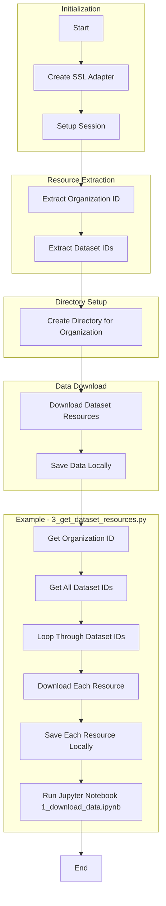

## Open Data - Kingdom of Saudi Arabia  
 
> This repository contains scripts to download datasets from the Open Data portal of the Kingdom of Saudi Arabia (KSA). The main script downloads all datasets for a given organization ID and saves them locally.  


### Directory Structure  

```{bash}
.
├── README.md
├── download_all_org.py
├── opendata (optional - parameter in file)
├── requirements.txt
├── open_ksa
│   ├── download_file.py
│   ├── organizations.py
│   ├── get_dataset_resources.py
│   └── get_org_resources.py
└── system-drawing.excalidraw

```
### Functions Overview  

- `organizations()`: Get the organization information, including the option to write to a target file as a CSV or JSON.
- `get_org_resources(org_id)`: Retrieves the organization name, organization ID, and dataset IDs for the specified organization.
- `get_dataset_resources(dataset_ids, allowed_exts=['csv', 'xlsx', 'xls'], output_dir='opendata/org_resources', verbose=False)`: Downloads all data resources for the specified dataset IDs.
- `download_file(session, url, headers, file_path)`: Downloads a file from the specified URL using the provided session and headers.

### Process Flow



### Installation 

To begin collecting data using the `open-ksa` package, simply install via `pip`:

```bash
pip install open-ksa
```

### Usage

For examples on how to use the package, see the following folders:
- [Scripts](/examples/scripts/)
- [Workbooks](/examples/workbooks/)

These illustrate how to use the package in a script or workbook and examples on how to collect information for one or multiple organizations.

NOTE: For a different organization, you need to update the parameter in the file for the `org_id` parameter in the function


### Release Plan / To DO

- [X] Create a set of functions to cover the entire API, including:
    - [X] Create a function to get the list of organizations
    - [X] Create a function to get the list of datasets for an organization
    - [X] Create a function to get the list of resources for a dataset
    - [X] Create a function to download a resource
    - [X] Create a function to check the status of a download
- [X] Create a set of unit tests for the functions
- [X] Create a set of examples for the functions
- [ ] Create a set of documentation for the functions
- [X] Move the repository to a PyPi library

### Contribution

The contribution process is as follows:

1. Clone the repository and create a new branch
2. Make your changes, following the coding style guidelines
3. Create a pull request with a detailed description of your changes
4. Wait for your pull request to be reviewed and approved
5. Once approved, your changes will be merged and available in the main branch

When contributing to this repository, please first discuss the change you wish to make via issue,
email, or any other method with the owners of this repository before making a change.

Please note we have a code of conduct, please follow it in all your interactions with the project.